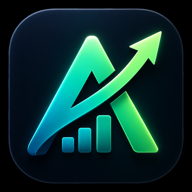

<p align="center">
  
</p>

<h1 align="center">Ascend</h1>

<p align="center">
  <strong>Tus finanzas personales como un juego. Sin estrés.</strong><br/>
  Gastos, ahorros, suscripciones, deudas y objetivos — en una PWA móvil.
</p>

---

## ✨ Características

- **Dashboard bento** con saldo, gastos del mes, suscripciones y objetivos activos.
- **Gastos** por categoría con búsqueda y filtros.
- **Suscripciones** editables (toca para modificar precio, día, icono).
- **Objetivos** de ahorro con barra de progreso y aportes guiados.
- **Deudas** (me deben / yo debo) con saldado rápido.
- **Calculadoras**: ahorro, deuda con interés, regla 50/30/20, interés compuesto.
- **5 temas de color** (Menta, Violeta, Coral, Ámbar, Océano) seleccionables en caliente.
- **Gamificación**: XP, niveles, racha diaria y logros.
- **Accesibilidad**: respeta `prefers-reduced-motion`, etiquetas ARIA, foco visible.
- **PWA**: instalable en iOS y Android, funciona standalone.

## 🚀 Cómo lanzar

Es un único `index.html` que carga React, Tailwind y Babel desde CDN. No hay build.

```bash
# Servidor local
python3 -m http.server 5560

# Luego abrir
open http://localhost:5560
```

O publica el repo en **GitHub Pages** y la app vive en `https://<usuario>.github.io/<repo>/`.

## 📂 Estructura

```
.
├── index.html              # Toda la app (React vía CDN)
├── manifest.json           # Manifiesto PWA
├── icons/
│   ├── icon-192.png        # Icono PWA (Android, navegador)
│   ├── icon-512.png        # Icono PWA grande
│   ├── icon-1024.png       # Para stores futuras
│   ├── apple-touch-icon.png # 180×180 para iOS home screen
│   ├── favicon-32.png      # Favicon navegador
│   ├── favicon-16.png      # Favicon pequeño
│   └── icon-source-original.png  # Master original 1254×1254
├── README.md
└── .gitignore
```

## 🛠 Stack

- React 18 (UMD)
- Tailwind CSS (CDN)
- Babel Standalone (compilación in-browser)
- LocalStorage para persistencia
- Bricolage Grotesque + Fraunces (Google Fonts)

## 📦 Datos

Todos los datos viven en `localStorage` bajo la clave `ascend_v1`. Si se detecta JSON corrupto al cargar, se hace **backup automático** en `ascend_v1_corrupt_backup` antes de restablecer al estado por defecto. El usuario ve un banner ámbar avisando.

Migración suave: si existen datos antiguos bajo `mint_app_v1` (versión previa), se copian automáticamente a `ascend_v1` la primera vez.

## 📱 Instalar como PWA

- **iOS Safari**: Compartir → "Añadir a pantalla de inicio".
- **Android Chrome**: menú → "Añadir a pantalla de inicio" o "Instalar app".

## Licencia

Personal. Hecho con cariño.
